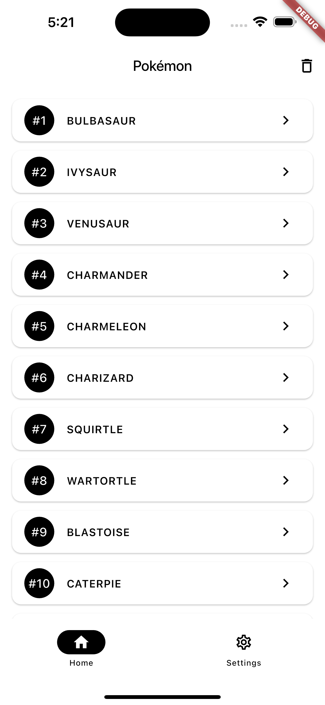
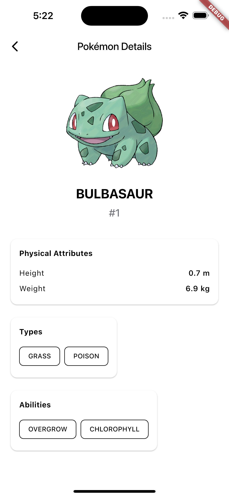
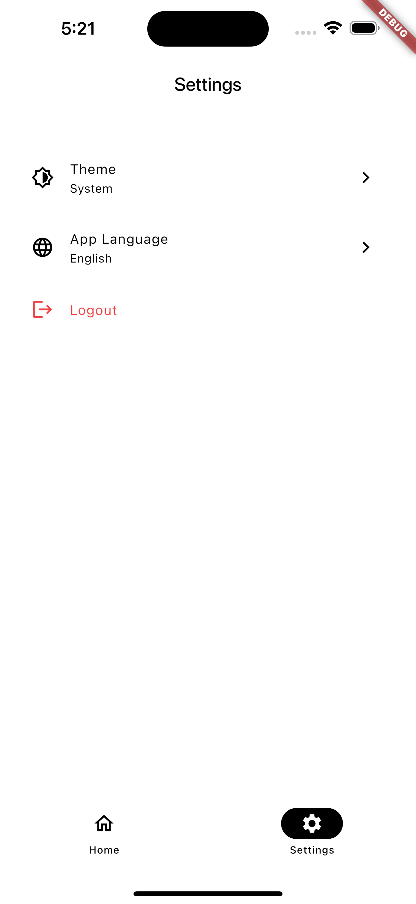
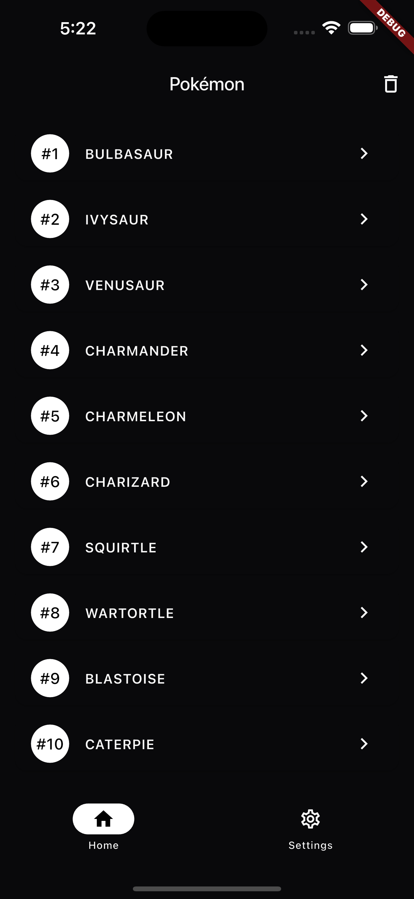
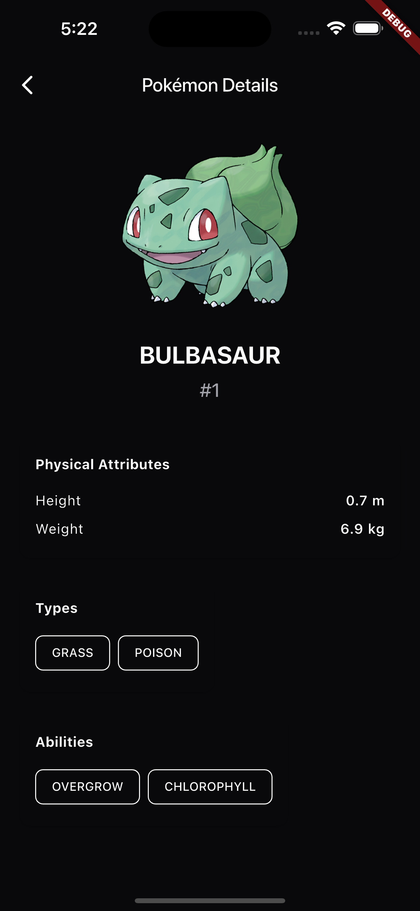
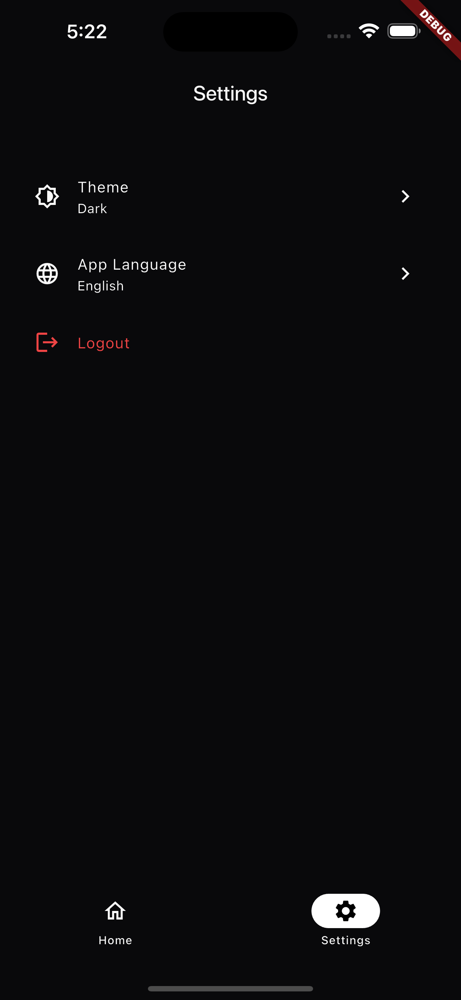

# Clean

Flutter application demonstrating clean architecture with BLoC pattern.

## Screenshots

<table>
  <tr>
    <td></td>
    <td></td>
    <td></td>
  </tr>
  <tr>
    <td></td>
    <td></td>
    <td></td>
  </tr>
</table>

## Features

- Authentication with secure token storage
- Pokemon list and detail views using PokeAPI
- Encrypted local caching with Hive
- Theme switching (Light/Dark/System)
- Multi-language support (English/Hindi)
- Offline-first architecture

## Architecture

Clean architecture with three layers:
- Presentation: BLoC for state management
- Domain: Business logic and use cases
- Data: API integration with Retrofit and local storage with Hive

## Tech Stack

- State Management: flutter_bloc
- Dependency Injection: injectable
- API Client: dio + retrofit
- Local Storage: hive_ce + flutter_secure_storage
- Functional Programming: fpdart
- Code Generation: freezed + build_runner
- Routing: go_router

## Setup

1. Install dependencies: `flutter pub get`
2. Generate code: `dart run build_runner build --delete-conflicting-outputs`
3. Add `.env` file with `ENCRYPTION_KEY` value
4. Run: `flutter run`